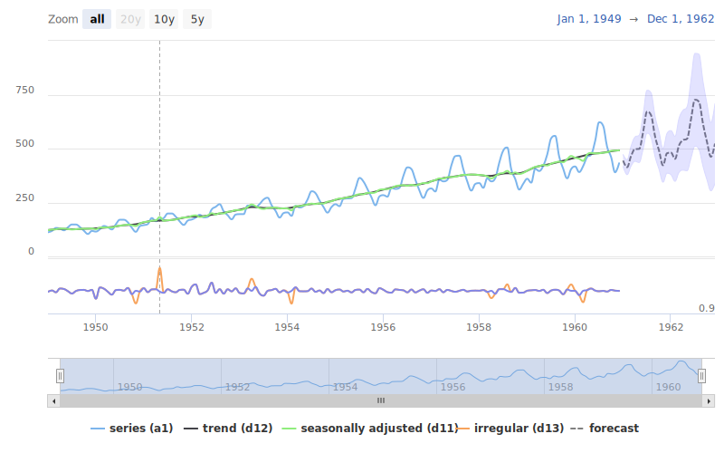

# persephone3 

High level interfaces for seasonal adjustment (and other timeseries models) via [jdemetra](https://jdemetra-new-documentation.netlify.app/).
This package focuses on batch processing, hierarchical timeseries and analytic charts.

## Installation

The following command installs `persephone3` as well as some other packages ([`rjd3x13`](https://github.com/rjdverse/rjd3x13) and [`rjd3tramoseats`](https://github.com/rjdverse/rjd3tramoseats)) that talk with the java interface.

```r
remotes::install_github("statistikat/persephone3")
```

<details>
  <summary>Install dependencies step by step</summary>
  
  ```r
remotes::install_github("rjdverse/rjd3tramoseats@b80f56a")
remotes::install_github("rjdverse/rjd3x13@c275301")
```

</details>
  
  ## Usage
  
  As a high-level package, the aim of `persephone3` is to provide sensible defaults for the adjustment methods. See `?perHts` for an overview about the possible model parameters. See the pkgdown documentation for more information about the usage of this package.

```r
library(persephone3)
# construct a ts-model object
x <- perX13(AirPassengers)
# run the model
x$run()
# visualize the results
hchart(x)
```

<p align="center"></p>
  
  The (fav)icon of this package was adapted from this design: [flaticon/season_3093366](https://www.flaticon.com/free-icon/season_3093366)
