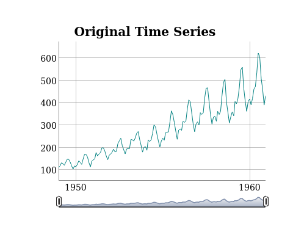

<!-- README.md is generated from README.Rmd. Please edit that file -->

# persephone

[](https://travis-ci.org/statistikat/persephone)
[](https://www.tidyverse.org/lifecycle/#experimental)
[](https://github.com/statistikat/persephone)
[](https://github.com/statistikat/persephone/commits/master)
[](https://coveralls.io/r/statistikat/persephone?branch=master&service=github)

This package is an object oriented wrapper around the R Package
[RJDemetra](https://github.com/nbbrd/rjdemetra), which performs time
series adjustments with the java library
[JDemetra+](https://github.com/jdemetra)

## Installation

You can install the package directly from GitHub with

``` r
devtools::install_github("statistikat/persephone")
```

## Usage

Objects can be constructed with `x13Single$new` or
`tramoseatsSingle$new`. Subseqentually, the `run` method runs the model
and `output` gives access to the output object from `RJDemetra`.

``` r
library(persephone)

obj <- x13Single$new(AirPassengers)
plot(obj)
```



The original output from [RJDemetra](https://github.com/nbbrd/rjdemetra)
can be inspected via the `output` field.

``` r
obj$run()
obj$output$regarima
#> y = regression model + arima (0, 1, 0, 0, 1, 1)
#> Log-transformation: yes
#> Coefficients:
#>           Estimate Std. Error
#> BTheta(1)  -0.5007      0.081
#> 
#>              Estimate Std. Error
#> Monday      -0.001527      0.004
#> Tuesday     -0.007677      0.004
#> Wednesday   -0.001125      0.004
#> Thursday    -0.005350      0.004
#> Friday       0.004676      0.004
#> Saturday     0.003025      0.004
#> Easter [1]   0.017999      0.008
#> AO (5-1951)  0.109258      0.020
#> 
#> 
#> Residual standard error: 0.03006 on 131 degrees of freedom
#> Log likelihood = 271.5, aic = 947.6 aicc = 949.5, bic(corrected for length) = -6.674
```

## Further reading

More information can be found on the [github-pages
site](https://statistikat.github.io/surveysd/) for persephone.

  - The [plotting
    vignette](https://statistikat.github.io/persephone/articles/plotting.html)
    contains examples of interactive plots
  - An overview of the package is available in the [useR\!2019
    slides](https://statistikat.github.io/persephone/articles/presentation_useR.pdf)
