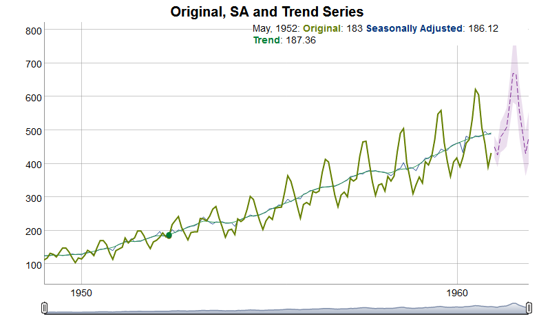
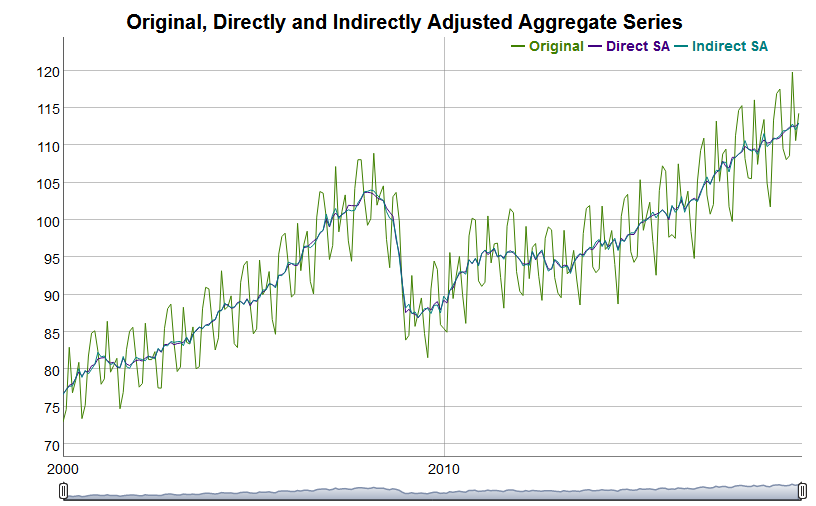

## Disclaimer

still under development...

```{r , echo=FALSE, fig.cap="https://xkcd.com/1319/", out.width = '55%'}
knitr::include_graphics("automation_2x.png")
```

## Objective

Replace R-package *x12* in production @ Statistics Austria for seasonal adjustment.

Requirements:

* Easy processing of multiple time series
* Support of hierarchical time series
* Weighted aggregate series
* R environment

&rarr; Build wrapper around **RJDemetra** to fit our needs

## Overview

* **persephone** provides SA-infrastructure for official statistics, i.e.
dealing with multiple (hierarchical) monthly/quarterly time series
* Functions of **RJDemetra** performing SA are called in the background.
* Available on https://github.com/statistikat/persephone

## Constructing Persephone Objects

1. _'Single'_ persephone objects are constructed with the functions `perX13()` or `perTramo()` 
depending on the choice of SA method (X-13-ARIMA-SEATS or TRAMO-SEATS).
1. _'Batch'_ persephone objects are constructed with the functions `perBatch()` as combination of single objects.
2. Multiple 'single' objects can be combined hierachically with `perHts()` to build a _hierarchical_ persephone object.

## Example 1: Persephone Single Object

* Starting from a predefined JDemetra+ model specification has to be provided by the user, e.g. `"RSA3"` 
* Updating parameters as needed
```{r, include=FALSE}
require(persephone)
```
```{r}
data(AirPassengers, package = "datasets")
objX13 <- perX13(AirPassengers, "RSA3")
objX13$updateParams(transform.function = "Log")
```

* Different methods can be called on the persephone objects

```{r}
objX13$run()
```

## Example 1: Persephone Single Object

* Several plot methods have been implemented with the focus on using interacive tools, e.g. the default S3 generic `plot()` 
shows a zoomable line representation of the series.
```{r , eval=FALSE, fig.cap="\\label{fig:plotmethod} Output of the plot() method in the R-Studio viewer pane", out.width = '65%'}
plot(objX13)
```
```{r , echo=FALSE, fig.cap="\\label{fig:plotmethod} Output of the plot() method in the R-Studio viewer pane", out.width = '65%'}

```

```{r, include = FALSE}
data(pi_caladj, pi_sa, pi_unadj, weights_pi_ea19, weights_pi_eu28)
```

```{r, include = FALSE}
pi_caladj_orig <- pi_caladj
pi_caladj <- pi_caladj[, -c(1:2)]
pi_caladj <- window(pi_caladj, end = c(2019, 5))
# Euro-Area Countries
ea19 <- weights_pi_ea19$country
# EU-28 Countries
eu28 <- weights_pi_eu28$country
```

## Example 2: Persephone Hierarchical Object

* We generate a list of persephone single objects with x13 as method for all countries’ time series.

```{r}
ts_28 <- lapply(pi_caladj, perX13, template = "RSA3")
```

* We aggregate the Euro-area (EA-19) countries and set the method to be used 
for the direct adjustment of the aggregate series to x13 as well.

```{r}
hts_EA19 <- perHts(list = ts_28[ea19], method = "x13")
```

## Example 2: Persephone Hierarchical Object

* We then generate our final hierarchical persephone object `hts_EU28` which consists of the 
Euro-area countries as a hierarchical object and the remaining 9 countries as single objects.

```{r}
non_ea19 <- eu28[which(!eu28 %in% ea19)]
non_ea19
hts_EU28 <- perHts(list = c(EA19 = hts_EA19, ts_28[non_ea19]))
```

## Example 2: Persephone Hierarchical Object

* The structure of this object is represented in the `print` output. The "blank" component is the overall total.
* With a simple call to the `run()` method all subseries will be adjusted
```{r, echo_size=8, output_size=6}
hts_EU28
hts_EU28$run()
```

## Example 2: Persephone Hierarchical Object


 * General comparison line chart called through the S3 generic `plot()` 
(only plot function for hierarchical persephone objects at the moment)

```{r , eval=FALSE, echo_size=8}
plot(hts_EU28)
```
```{r , echo=FALSE, fig.cap="\\label{fig:plotmethodhts} Output of the plot() method for a hierarchical persephone object in the R-Studio viewer pane", out.width = '65%'}

```

## Example 2: Persephone Hierarchical Object

* Generate Eurostat quality report with the function `generateQrTable()`.

```{r, output_size=6}
head(generateQrTable(hts_EU28), n = 4)
```


## New Features I - Processing

* Persephone Batch Object `perBatch()`
* `fixModel()`  or `fixOutlier()`s (except for a timespan at the end of the series)
```{r, output_size=6}
objX13$fixModel(verbose=TRUE)
objX13$fixOutlier(verbose=TRUE)
```

## New Features II - Generate calendar regressor

```{r, eval = FALSE}
td7 <- genTd(freq = 4, hd = list("01-01", "01-06", 
             "easter+1", "easter+39"),
              weight = c(rep(1,11), 0.5, rep(1,2), 0.5))

```

## More to come

* Benchmark method for direct adjustments
* Indirect adjustment of chain-linked indices
* Summary method
* Dashboard for large numbers of time series
